# Lab_4 (25.09.2023)
## Test-cases (интернет-магазин [Ozon.by](https://ozon.by/))

<strong>KAD_1_lb3</strong>. Добавление товара в избранное. 
<strong>Краткое описание:</strong> проверка корректности
добавления товаров в панель "Избранные товары" 
<strong>Предусловие (входные данные):</strong> для того, чтобы у пользователя были сохранены
все товары в избаранном, он должен быть
зарегистрирован и авторизован в личном кабинете. 
<strong>Шаги:</strong> 
1. Зайти на сайт [Ozon.by](https://ozon.by/)
2. Посредствам поиска и/или панели "рекомендуем" найти необходимые товары
3. Выбрать необходимый товар
3. Открыть товар (или не открывать)
4. Нажать на символ "сердечко" 

<strong>Ожидаемый результат:</strong> товар добавился в панель "Избранное",
в верхней навигационной панели появился символ "+1"
возле соответствующего пункта меню. При переходе в него, там находится выбранный
нами товар: 
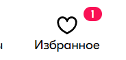 
<strong>Фактические результаты: </strong> как ожидали 
<strong>Статус: </strong> пройден успешно 

<strong>KAD_2_lb3</strong>. Регистрация. 
<strong>Краткое описание:</strong> проверка корректности
регистрации на сайте 
<strong>Предусловие (входные данные):</strong> Для выполнения этого теста
мы предварительно зайдём в панель регистрации нового пользователя.
Будем использовать следующие входные данные: 
<i>Номер телефона: +37544563***9</i> 
<strong>Шаги:</strong> 
2. Зайти на сайт [Ozon.by](https://ozon.by/)
3. Ввести свой номер телефона
2. Дождаться звонка
3. Ввести в качестве подтверждения 6 последних цифр телефона,
   с которого был совершен вызов
3. Поставить галочку рядом с согласием "условий использования сервисов Ozon..."
4. Нажать кнопку "Зарегистрироваться"

<strong>Ожидаемый результат:</strong> Пользователь успешно прошел регистрацию 
<strong>Фактические результаты: </strong> Надпись "Что-то пошло не так", но после
refresh web-страницы, вход в аккаунт, а, соответственно, и регистрация были выполнены
успешно! 
 
<strong>Статус: </strong> тест пройден частично 

<strong>KAD_1_lb4</strong>. Добавления адреса доставки. 
<strong>Краткое описание:</strong> Проверка праивльности добавления адреса
для доставки товара 
<strong>Предусловие (входные данные):</strong> Мы авторизованы в системе
(т.е. выполнен вход в личный кабинет) 
<strong>Шаги:</strong> 
2. Зайти на сайт [Ozon.by](https://ozon.by/)
3. Выбрать на панели меню пункт "Укажите адрес доставки"
2. У нас появляется окно с двумя вариантами выбора (изменить город и выбрать на карте). 
Выбираем город Минск, затем "выбрать на карте"
3. Выбираем удобный пункт самовывоза и нажимаем кнопку "Заберу отсюда"
    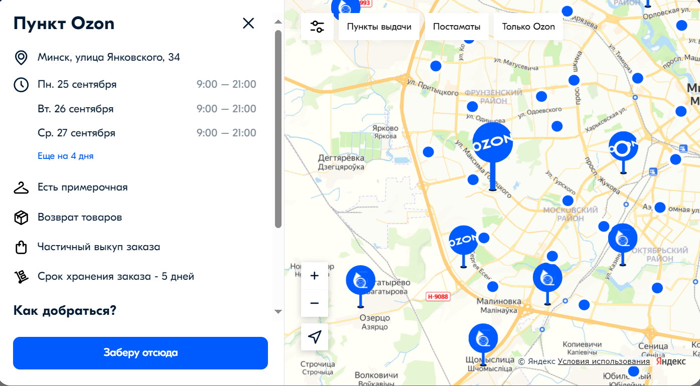 
3. Проверяем, чтобы адрес на панели изменился

<strong>Ожидаемый результат:</strong> Адрес доставки добавлен и отображается в верхней панели 
<strong>Фактические результаты:</strong> Соответствует ожидаемому результату 
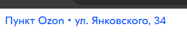 
<strong>Статус: </strong> Тест пройден успешно 

<strong>KAD_2_lb4</strong>. Добавления фотографии в профиль. 
<strong>Краткое описание:</strong> Проверка корректности добавления аватарки для профиля
в личном кабинете 
<strong>Предусловие (входные данные):</strong> Мы авторизованы в системе
(т.е. выполнен вход в личный кабинет) 
<strong>Шаги:</strong> 
2. Зайти на сайт [Ozon.by](https://ozon.by/)
3. Нажать в верхнем меню кнопку "Кабинет"
2. Появится новое окно с информацией про аккаунт, нажать там на закругленную фотографию со
смайликом головы человека
3. После нажатия открывается проводник. Выбираем необходимую фотографию 
4. Выбрали по "ошибке" файл с расширением .pdf. Фотография не применилась, но происходит постоянная
загрузка и информации про ошибку не вывелось. В следующий раз выбираем
уже необходимый формат
3. Проверяем, что фотография применилась

<strong>Ожидаемый результат:</strong> Фотография применилась, происходит обработка ошибок
при добавлении файла в неверном формате 
<strong>Фактические результаты:</strong> Фотография добавилась, обработка ошибок не предусмотрена 
 
<strong>Статус: </strong> Тест пройден частично 

<strong>KAD_3_lb4</strong>. Изменение валюты. 
<strong>Краткое описание:</strong> Проверка изменения валюты, в которой
указывается стоимость товаров 
<strong>Предусловие (входные данные):</strong> нету 
<strong>Шаги:</strong> 
2. Зайти на сайт [Ozon.by](https://ozon.by/)
3. Выбрать на панели меню пункт с названием текущей валюты
2. У нас появляется окно с возможностью выбора
валюты, необходимо выбрать из выпадающего списка
   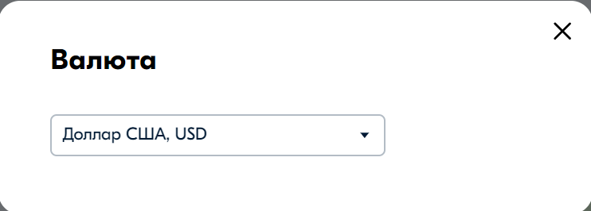 
3. Проверяем, чтобы валюта на панели изменился

<strong>Ожидаемый результат:</strong> Валюта изменена и отображается в верхней панели 
<strong>Фактические результаты:</strong> Соответствует ожидаемому результату 
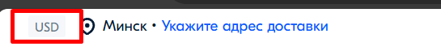 
<strong>Статус: </strong> Тест пройден успешно 

<strong>KAD_4_lb4</strong>. Выполнение поиска товара. 
<strong>Краткое описание:</strong> Необходимо найти товар, который мы ищем
по запросу в поисковой панели. Проверить, чтобы он соответствовал нашему запросу 
<strong>Предусловие (входные данные):</strong> нету 
<strong>Шаги:</strong> 
2. Зайти на сайт [Ozon.by](https://ozon.by/)
3. Ввести запрос в окно ввода для поиска товара. Вводим
   "чехол для телефона"
2. Нажать кнопку с иконкой лупы 
   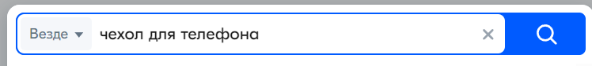 
3. Выводится список товаров по нашему запросу

<strong>Ожидаемый результат:</strong> Появляется список товаров, соответствующий 
нашему запросу 
<strong>Фактические результаты:</strong> Соответствует ожидаемому результату 
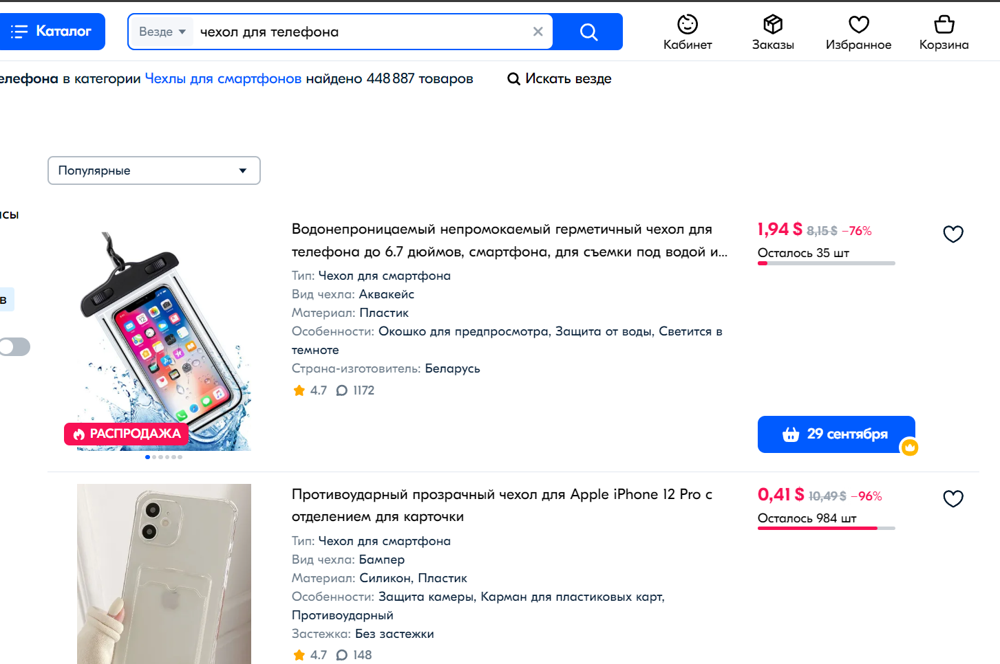 
<strong>Статус: </strong> Тест пройден успешно 

<strong>KAD_5_lb4</strong>. Добавления товара в корзину. 
<strong>Краткое описание:</strong> проверка корректности
добавления товаров в панель "Корзина" 
<strong>Предусловие (входные данные):</strong> для того, чтобы у пользователя были сохранены
все товары в корзине, он должен быть
зарегистрирован и авторизован в личном кабинете. 
<strong>Шаги:</strong> 
1. Зайти на сайт [Ozon.by](https://ozon.by/)
2. Посредствам поиска и/или панели "рекомендуем" найти необходимые товары
3. Выбрать необходимый товар
3. Открыть товар (или не открывать)
4. Нажать на символ "добавить в корзину" 
   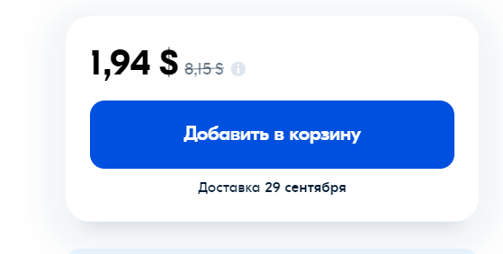 

<strong>Ожидаемый результат:</strong> товар добавился в панель "Корзина",
в верхней навигационной панели появился символ "+1"
возле соответствующего пункта меню. При переходе в него, там находится выбранный
нами товар: 
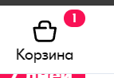 
<strong>Фактические результаты: </strong> как ожидали 
<strong>Статус: </strong> пройден успешно 

<strong>KAD_6_lb4</strong>. Проверка инфомации про товар. 
<strong>Краткое описание:</strong> проверка корректности
и актуальности данных при описании товара 
<strong>Предусловие (входные данные):</strong> нету 
<strong>Шаги:</strong> 
1. Зайти на сайт [Ozon.by](https://ozon.by/)
2. Посредствам поиска и/или панели "рекомендуем" найти необходимые товары
3. Выбрать необходимый товар
3. Открыть товар
4. Найти информацию про наличие товара, его стоимость, описание
оставшееся количество и т.д. 
   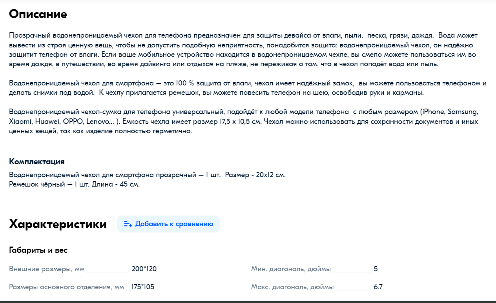 

<strong>Ожидаемый результат:</strong> Найдена вся необходимая информация про товар 
<strong>Фактические результаты: </strong> как ожидали 
<strong>Статус: </strong> пройден успешно 

<strong>KAD_7_lb4</strong>. Проверка сортировки товара. 
<strong>Краткое описание:</strong> проверка корректности
выполнения сортировки товара по заданному критерию 
<strong>Предусловие (входные данные):</strong> нету 
<strong>Шаги:</strong> 
1. Зайти на сайт [Ozon.by](https://ozon.by/)
2. Ввести в поле поиска необходимый запрос
3. В панели с выбором типа спортировки выбрать необходимый критерий.
В данном случае - "Сначала дорогие".
3. Просмотреть список товаров, который должен отсортироваться
4. Найти информацию про наличие товара, его стоимость, описание
   оставшееся количество и т.д. 
   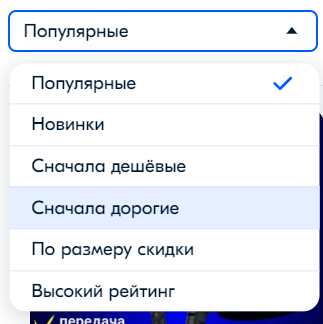 

<strong>Ожидаемый результат:</strong> Товары отсортировались по заданному критерию 
<strong>Фактические результаты: </strong> появились товары, котоыре не соответствуют нашему
поиску. Зато в порядке убывания стоимости)) 
<strong>Статус: </strong> пройден частично 
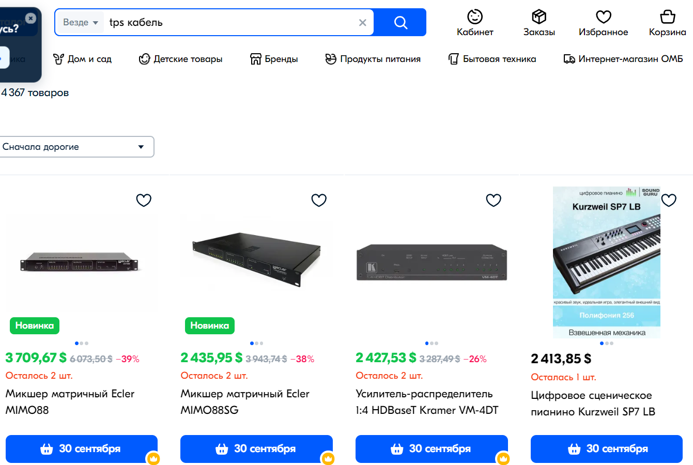 

<strong>KAD_8_lb4</strong>. Просмотр текущих акций и скидок 
<strong>Краткое описание:</strong> проверка наличия актуальных скидок и акций, 
которые представляют магазины 
<strong>Предусловие (входные данные):</strong> нету 
<strong>Шаги:</strong> 
1. Зайти на сайт [Ozon.by](https://ozon.by/)
2. В поле для выполнения запроса выбираем "Распродажио"
3. Переходим на страницу и видим список актуальных распродаж
    

<strong>Ожидаемый результат:</strong> Появился список товаров, на которые действуют скидки
и/или акции 
<strong>Фактические результаты: </strong> Соответсвует ожидаемому результату 
<strong>Статус: </strong> пройден успешно 

